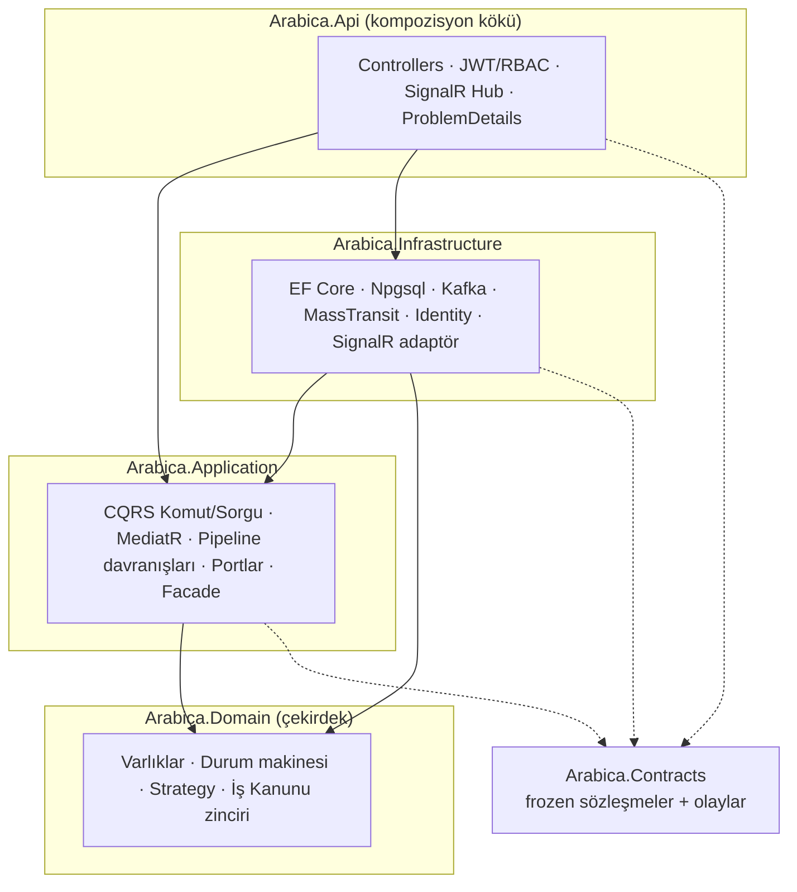
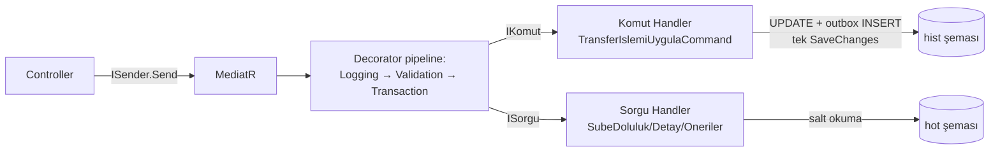
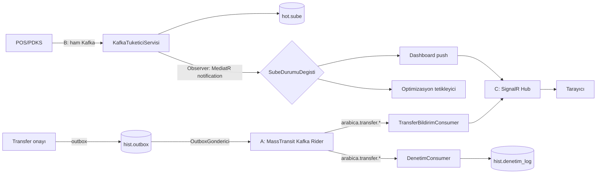
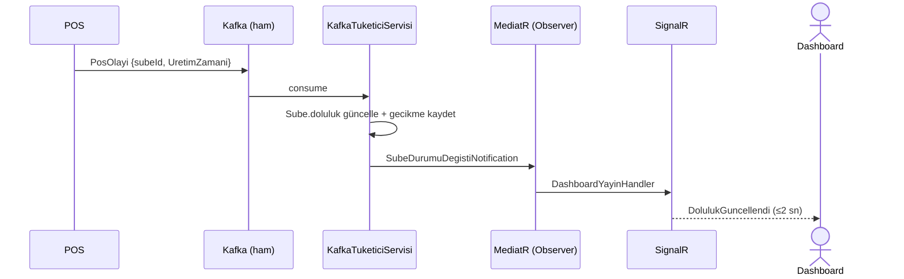

# Arabica Cafe Dinamik Kaynak Yönetim Sistemi — Proje Raporu

**Platform:** C# 12 / .NET 8 LTS · ASP.NET Core 8 · EF Core 8 + Npgsql · PostgreSQL 16 · Apache Kafka 3.7 · MassTransit (ESB) · SignalR · Docker
**Mimari:** Onion (Soğan) Mimarisi · CQRS · Event-Driven · Transactional Outbox
**Dil:** Etki alanı (domain) tanımlayıcıları ve kullanıcı arayüzü Türkçe; kod yorumları İngilizce.

> Bu sistem, Java/Spring Boot referans tasarımının (`project-srs.md`, `context.md`, `agent_handoff.md`) .NET 8 ekosistemine **davranışsal olarak sadık** bir yeniden gerçekleştirimidir. Mikroservise geçilmemiş; Onion monolit korunmuştur.

---

## 1. Proje Özeti

Arabica Cafe şubeleri (pilot: Isparta) arasındaki **müşteri yoğunluğu dengesizliğini** (atıl ↔ darboğaz) çözmek için, şubelerdeki **POS** (satış) ve **PDKS** (personel devam) cihazlarından **Apache Kafka** üzerinden akan gerçek zamanlı veriyi işleyip, **otonom barista/ekipman transfer önerileri** üreten olay güdümlü bir **karar destek** sistemidir. Yöneticiler önerileri onaylar/reddeder.

**Başarı ölçütleri (SRS):** atıl kapasitede %30 azalma, hizmet süresinde %20 iyileşme, operasyonel maliyette %15 düşüş, **uçtan uca gecikme ≤ 2 sn (NFR-P1)**.

---

## 2. On Zorunlu Kapı — Uyumluluk Tablosu

| # | Kapı | Durum | Nerede / Dosya |
|---|------|:-----:|----------------|
| 1 | **Proje raporu (TR)** | ✅ | Bu belge (`PROJE-RAPORU.md`) + `UYUMLULUK-PLANI.md`, `migration-blueprint.md` |
| 2 | **Sistem çalışıyor** | ✅ | `docker compose up` → §10 Çalıştırma Kanıtı (Liquibase + 5 uç + SignalR + gecikme) |
| 3 | **OOP + SOLID** | ✅ | `Personel`(abstract)→`Barista`/`SubeMuduru`; private set + davranış zengini varlıklar; her sınırda arayüz (DIP) — `src/Arabica.Domain/**` |
| 4 | **≥1 Yaratımsal desen** | ✅ (2) | **Factory Method** `TransferEmriFactory`, **Builder** `KapasiteRaporuBuilder` |
| 5 | **≥2 Yapısal desen** | ✅ (3) | **Adapter** (SignalR + Kafka), **Decorator** (MediatR pipeline), **Facade** (`KaynakYonetimFasadi`) |
| 6 | **≥2 Davranışsal desen** | ✅ (4+1) | **Strategy**, **State**, **Chain of Responsibility**, **Observer** (+ **Mediator** bonus) |
| 7 | **Onion Mimarisi** | ✅ | Domain ← Application ← Infrastructure; `Arabica.Api` tek kompozisyon kökü — §3 |
| 8 | **ESB** | ✅ | **MassTransit Kafka rider** (compose); 2 bağımsız consumer (bildirim + denetim) — §5 |
| 9 | **CQRS** | ✅ | Komut (`HistoryDbContext`+outbox) ↔ Sorgu (`HotDbContext`) ayrımı; MediatR — §4 |
| 10 | **Gerçek-zamanlı iletişim** | ✅ | **SignalR** hub + `@microsoft/signalr` JS istemci; canlı doluluk + transfer bildirimi — §6 |

---

## 3. Onion Mimarisi (Gate #7)

Bağımlılıklar **içe** doğrudur; en içte etki alanı, en dışta API. `Arabica.Api` tek kompozisyon köküdür.



**Bağımlılık kuralı:** `Domain` hiçbir şeye bağlı değildir; `Application` yalnızca `Domain`+`Contracts`'a; `Infrastructure` portları uygular; `Api` her şeyi birleştirir. İçteki katmanlar dıştakileri **bilmez** (DIP).

---

## 4. CQRS — Komut/Sorgu Akışı (Gate #9)

Yazım ve okuma modelleri **fiziksel olarak ayrıdır**: komutlar `HistoryDbContext` (+ outbox), sorgular `HotDbContext` (NFR-P4 şema izolasyonu).



- **Komut:** `TransferIslemiUygulaCommand` → handler durum geçişini uygular + **integration event'i outbox'a yazar**; `TransactionBehavior` tek `SaveChanges` ile UPDATE+outbox'ı **atomik** commit eder.
- **Sorgu:** `SubeDolulukQuery`, `SubeDetayQuery`, `BekleyenTransferOnerileriQuery`, `TransferSubeleriQuery` — yalnız okuma.

---

## 5. ESB Topolojisi (Gate #8) — Üç Ayrı Kanal

> **Net ayrım:** Sistemde üç farklı mesajlaşma kanalı vardır ve birbirine karıştırılmamalıdır.

| Kanal | Teknoloji | Amaç |
|-------|-----------|------|
| **(A) ESB** | **MassTransit Kafka rider** | İş/integration olayları: `TransferOnaylandi/Reddedildi/Tamamlandi` → 2 bağımsız consumer |
| **(B) Gerçek-zaman ingest** | **Ham Confluent.Kafka** | Yüksek hacimli POS/PDKS akışı → şube doluluğu güncelleme |
| **(C) Gerçek-zaman push** | **SignalR (WebSocket)** | Tarayıcıya canlı doluluk + transfer bildirimi |



**ESB iki bağımsız consumer:** `TransferBildirimConsumer` (→ SignalR push) ve `DenetimConsumer` (→ `denetim_log` audit). Aynı olayı ikisi de bağımsızca tüketir.

**Taşıma seçimi:** `Esb:Transport=Kafka` (compose/üretim, broker üzerinde rider) | `Bellek` (hızlı birim testleri, in-memory). MassTransit 8.x (Apache-2.0) sabittir.

---

## 6. Sequence Diyagramları

### 6.1 Transfer Onayı (MFA + outbox + ESB + SignalR)

```mermaid
sequenceDiagram
    actor Y as Yönetici
    participant API as TransferController
    participant MFA as IMfaDogrulayici
    participant H as KomutHandler
    participant DB as HistoryDbContext
    participant OD as OutboxGonderici
    participant ESB as Kafka Rider
    participant SR as SignalR

    Y->>API: POST /transfer/islem {transferId,aksiyon} + X-MFA-Code
    API->>API: RBAC şube-kapsam kontrolü (Şube Müdürü)
    API->>MFA: TOTP doğrula (ONAYLA için)
    API->>H: TransferIslemiUygulaCommand
    H->>H: DurumGuncelle (state machine; geçersiz→409)
    H->>DB: UPDATE transfer + INSERT outbox (tek SaveChanges, atomik)
    OD->>DB: yayınlanmamışları oku
    OD->>ESB: TransferOnaylandi publish
    ESB->>SR: TransferBildirimConsumer → push
    SR-->>Y: gerçek zamanlı "Transfer Onaylandı"
```

### 6.2 Gerçek Zamanlı Doluluk (Kafka ingest → SignalR)



---

## 7. Tasarım Deseni Kataloğu

| Kategori | Desen | Uygulayan tip / dosya | Gerekçe |
|----------|-------|-----------------------|---------|
| Yaratımsal | **Factory Method** | `TransferEmriFactory` — `src/Arabica.Domain/Transferler/Transferler.cs` | Personel/Ekipman emri yaratımını merkezîleştirir, istemciyi somut tipten ayırır. |
| Yaratımsal | **Builder** | `KapasiteRaporuBuilder` — `src/Arabica.Application/Raporlama/KapasiteRaporu.cs` | Kapasite raporunu adım adım (fluent) kurar; agregaları biriktirir. |
| Yapısal | **Adapter** | `SignalRDashboardNotifier` — `src/Arabica.Api/RealTime/DolulukHub.cs`; `MassTransitYayinci`/`KafkaRiderYayinci` — `src/Arabica.Infrastructure/Esb/`; `KafkaOlayAdaptoru` — `.../Mesajlasma/` | Port'ları SignalR/MassTransit'e ve ham Kafka'yı domain olayına uyarlar. |
| Yapısal | **Decorator** | `LoggingBehavior`/`ValidationBehavior`/`TransactionBehavior` — `src/Arabica.Application/Davranislar/PipelineDavranislari.cs` | Her handler'ı kesişen ilgilerle sarar (MediatR `IPipelineBehavior`). |
| Yapısal | **Facade** | `KaynakYonetimFasadi` — `src/Arabica.Application/Fasad/KaynakYonetimFasadi.cs` | Optimizasyon + şube + strateji alt sistemlerini tek arayüzde toplar. |
| Davranışsal | **Strategy** | `IOptimizasyonServisi` → `VizeFinalSezonStratejisi`/`YazDonemiStratejisi` + resolver — `src/Arabica.Domain/Optimizasyon/`, `.../Infrastructure/Optimizasyon/` | Mevsime göre çalışma-zamanı algoritma değişimi (keyed DI). |
| Davranışsal | **State** | `TransferEmri` durum makinesi — `src/Arabica.Domain/Transferler/Transferler.cs` | İzinli geçiş tablosu; geçersiz geçiş `InvalidOperationException`. |
| Davranışsal | **Chain of Responsibility** | `IsKanunuHalkasi` zinciri — `src/Arabica.Domain/IsHukuku/IsHukuku.cs` | Her İş Kanunu (4857) muhafızı geçirir/engeller; ilk ihlal zinciri keser. |
| Davranışsal | **Observer** | `SubeDurumuDegistiNotification` + handler'lar — `src/Arabica.Application/Olaylar/Bildirimler.cs` | Kafka olayını çok aboneye gevşek bağlı dağıtır. |
| Davranışsal (bonus) | **Mediator** | MediatR `ISender`/`IPublisher` | Komut/sorgu/notification dağıtımı. |

---

## 8. KVKK ve İş Kanunu Uyumu

### 8.1 KVKK (6698) — NFR-L1
- **Kişisel veri yok:** `hot`/`hist` şemalarındaki tablolar ve Kafka/ESB olayları yalnızca **anonim sayısal kimlikler** (`PersonelId`, `SubeId`) taşır; TC/ad-soyad/telefon **işlenmez**. `Personel` tipinde PII alanı **yoktur** (yalnız `PersonelId` + `TakmaAd`).
- **Kimlik izolasyonu:** Giriş kimlik bilgileri ayrı, erişimi kısıtlı **`kimlik`** şemasında (`kullanicilar`) tutulur; parolalar **tuzlanmış PBKDF2** (`PasswordHasher<T>`) ile saklanır.

### 8.2 İş Kanunu (4857) — NFR-L2
- **Chain of Responsibility** muhafız zinciri (`GunlukAzamiMesaiKurali`, `HaftalikAzamiMesaiKurali`, `ZorunluMolaKurali`): günlük/haftalık azami mesai aşılıyorsa veya yasal mola hak edilmişse transfer **engellenir** (gerekçeli).
- **Yol süresi mesaiye dahildir:** `IsKanunuBaglami.TransferSonrasiGunlukMesai = Bugünçalışılan + SeyahatSuresi`.

### 8.3 Diğer güvenlik
- JWT (stateless, 15 dk), policy-tabanlı RBAC, **MFA (TOTP)** kritik onayda (`X-MFA-Code` header), **AES-256** Data Protection, ProblemDetails, **denetim logu** (aktör + IP + zaman), DB portları dışa kapalı.

---

## 9. Çalıştırma Kılavuzu

### Önkoşullar
- Docker + Docker Compose. (Geliştirme/test için .NET 8 SDK.)

### Çalıştırma
```bash
docker compose up -d --build
# Sıra: postgres healthy → liquibase (hot/hist/kimlik) → app
# Panel:   http://localhost:8080
# Swagger: http://localhost:8080/swagger
# Health:  http://localhost:8080/health
```

### Demo kimlikler
| Kullanıcı | Parola | Rol | Şube |
|-----------|--------|-----|------|
| `tunahan.basar` | `Arabica.2026!` | Bölge Koordinatörü | — (tümü) |
| `sinan.say` | `Arabica.2026!` | Şube Müdürü | 1 |

MFA TOTP secret (demo): `JBSWY3DPEHPK3PXP` (base32). Onay için geçerli TOTP kodu `X-MFA-Code` header'ında gönderilir.

### Örnek istekler
```bash
# 1) Giriş → JWT
curl -X POST http://localhost:8080/api/v1/auth/login \
  -H "Content-Type: application/json" \
  -d '{"kullaniciAdi":"tunahan.basar","sifre":"Arabica.2026!"}'

# 2) Tüm şubelerin doluluğu (Koordinatör)
curl http://localhost:8080/api/v1/sube/doluluk -H "Authorization: Bearer <TOKEN>"

# 3) Bekleyen transfer önerileri
curl http://localhost:8080/api/v1/transfer/oneriler -H "Authorization: Bearer <TOKEN>"

# 4) Transfer onayı (MFA ile)
curl -X POST http://localhost:8080/api/v1/transfer/islem \
  -H "Authorization: Bearer <TOKEN>" -H "X-MFA-Code: <TOTP>" \
  -H "Content-Type: application/json" -d '{"transferId":1,"aksiyon":"ONAYLA"}'

# 5) Gecikme ölçümü: önce besle, sonra metrik
curl -X POST "http://localhost:8080/api/v1/demo/besle?adet=40" -H "Authorization: Bearer <TOKEN>"
curl http://localhost:8080/api/v1/metrik/gecikme -H "Authorization: Bearer <TOKEN>"
```

---

## 10. Çalıştırma Kanıtı (Gate #2)

> _Aşağıdaki çıktılar gerçek `docker compose up --build` çalıştırmasından alınmıştır (Docker v29.5.2)._

### 10.1 Konteyner durumu
```
SERVICE    STATUS
app        Up (health: Healthy)
kafka      Up (healthy)
postgres   Up (healthy)
```

### 10.2 Liquibase — hot/hist/kimlik şemaları uygulandı
```
Running Changeset: hot/001-sube.xml::hot-001-sube::arabica
Running Changeset: hist/001-transfer-emirleri.xml::hist-001-transfer-emirleri::arabica
Running Changeset: hist/002-outbox.xml::hist-002-outbox::arabica
Running Changeset: hist/003-denetim-log.xml::hist-003-denetim-log::arabica
Running Changeset: kimlik/001-kullanicilar.xml::kimlik-001-kullanicilar::arabica
UPDATE SUMMARY   Run: 6   Total change sets: 6
Liquibase: Update has been successful. Rows affected: 6
```

### 10.3 Uygulama başlangıcı — Kafka rider + topic + bus
```
Arabica.Infrastructure.Mesajlasma.KafkaTopicOlusturucu: Kafka topic'leri hazır (mevcut olanlar atlandı).
MassTransit: Configured endpoint arabica-esb, Consumer: ...Esb.TransferBildirimConsumer
MassTransit: Configured endpoint arabica-esb, Consumer: ...Esb.DenetimConsumer
MassTransit: Bus started: loopback://localhost/
```

### 10.4 Sağlık
```
GET /health  →  HTTP 200  "Healthy"
```

### 10.5 Beş frozen uç + JWT
```
[1] POST /api/v1/auth/login         → 200  rol=BolgeKoordinatoru, gecerlilikSaniye=900, token(372)
[2] GET  /api/v1/sube/doluluk       → 200  [{1 "Isparta Merkez" %25.00 Yesil}, {2 "S.D.Ü. Kampüs" %95.00 Kirmizi}]
[3] GET  /api/v1/sube/1/detay       → 200  {subeId:1, "Isparta Merkez", %25.00, Yesil}
[4] GET  /api/v1/transfer/oneriler  → 200  {transferId:1, kaynak:1→hedef:2, Personel, Bekliyor}
[5] POST /api/v1/transfer/islem     → 200  {transferId:1, durum:"Onaylandi"}   (X-MFA-Code: geçerli TOTP)
```

### 10.6 ≤ 2 sn uçtan uca gecikme (NFR-P1 / M4)
40 POS olayı `POST /api/v1/demo/besle?adet=40` ile Kafka'ya beslendi → `GET /api/v1/metrik/gecikme`:
```
{ "adet": 40, "ortalamaMs": 60.2, "enYuksekMs": 1028.6, "p95Ms": 55.5, "esikAsanSayisi": 0 }
```
→ **40/40 olay 2 sn'nin altında** işlendi; p95 = 55.5 ms; 2 sn eşiğini aşan = 0. (Tek yüksek değer ilk olayın broker metadata ısınmasıdır.)

### 10.7 ESB — iki bağımsız consumer (Kafka rider, runtime)
Onay sonrası uygulama logu (outbox → Kafka rider → her iki consumer):
```
Arabica.Infrastructure.Esb.TransferBildirimConsumer: ESB▸bildirim: transfer 1 Onaylandi (1→2)        ← SignalR push
Arabica.Infrastructure.Esb.DenetimConsumer:          ESB▸denetim: ESB:TransferOnaylandi (transfer 1) loglandı  ← denetim_log
```

### 10.8 SignalR (gerçek-zaman, JWT-gated)
```
POST /hubs/doluluk/negotiate?access_token=<JWT>  → 200
availableTransports: WebSockets, ServerSentEvents, LongPolling
```
Observer fan-out (ingest yolunda her POS olayında): `OptimizasyonTetikleyiciHandler: "Şube X değişti → optimizasyon değerlendirildi"`.

---

## 10.9 UI (Demo SPA) Kullanımı ve Kanıtı

**Adres:** `http://localhost:8080` (statik SPA, `wwwroot` — vanilla ES6 + SignalR/Chart.js CDN; npm/derleme adımı yok). **Swagger:** `/swagger`.

> **Tasarım (UI yeniden kaplama):** Arayüz, Claude Design "Arabica Panel" handoff'undaki **espresso/krem kahve tasarım sistemiyle** (Hanken Grotesk · Spectral · JetBrains Mono; soğuk-renksiz kahve paleti; soldan sabit yan menü + üst bar) yeniden kaplanmıştır. Bootstrap kaldırılmış; tüm görsel dil `wwwroot/css/app.css` içindeki tasarım sistemine taşınmıştır. **İşlevsellik birebir korunmuştur** — tüm ekranlar canlı API'ye bağlıdır (giriş/JWT, rol bazlı menü, 5 frozen uç, Yönetim ekranları, SignalR, MFA modalı, Chart.js doluluk/trend, KVKK, 15 dk idle çıkış). Genel Bakış ekranı tasarıma uygun olarak **canlı doluluk barları** (`/sube/doluluk`) + **otonom transfer öneri kartları** (`/transfer/oneriler`, MFA ile onay) + Chart.js grafiklerini birlikte gösterir; Transfer Onayları **durum sekmelidir** (Bekliyor/Onaylandı/Reddedildi/Tamamlandı).

**Kimlik:** `tunahan.basar` (Koordinatör) / `sinan.say` (Müdür), şifre `Arabica.2026!`. **MFA TOTP secret (demo):** `JBSWY3DPEHPK3PXP` — modaldeki "🔑 Demo MFA kodu üret" düğmesi kodu istemci tarafında üretir.
JWT **sessionStorage**'da tutulur (NFR-S1), `Authorization: Bearer` ile gönderilir; **15 dk işlemsizlikte otomatik çıkış** (NFR-S8). Menü **rol bazlıdır**: erişilemeyen öğe DOM'a **eklenmez** (RBAC §2 — Şube Müdürü'nde "Raporlar" yoktur).

### Görünüm → Kapı eşlemesi
| Görünüm | Gösterdiği gate/gereksinim |
|---------|----------------------------|
| **Giriş (tam ekran)** | #2 çalışır + #3 güvenlik (JWT sessionStorage, idle çıkış, 401→login) |
| **Rol bazlı menü** | RBAC §2 (Müdür ≠ Raporlar/all-branches) |
| **Panel + canlı doluluk** | #10 SignalR (`DolulukGuncellendi`, ~1 Hz/değişimde, NFR-P2); "POS yükü simüle et" → **gecikme ≤ 2 sn rozeti** (NFR-P1/M4) |
| **Transferler + MFA modal** | MFA (TOTP/`X-MFA-Code`), #9 CQRS komutu, State (200/401/409), canlı `TransferBildirimi` toast |
| **Şube detay** | Branch-scope RBAC (Müdür başka şube → 403 zarif) |
| **Raporlar / Transfer geçmişi** | #9 CQRS — **yeni** salt-okuma uç `GET /api/v1/transfer/gecmis` (Koordinatör) |
| **KVKK / Uyumluluk** | KVKK (yalnız sayısal ID kanıtı) + 4857 (CoR muhafız zinciri) |

### Doğrulama yöntemi ve kanıt
> CLI ortamında görsel tarayıcı ekran görüntüsü alınamadığından, SPA'nın **tam olarak ürettiği HTTP istekleri ağ seviyesinde yeniden üretilmiş** ve doğrulanmıştır. Statik varlıklar HTTP 200 ile sunulmaktadır.
```
[A] GET /          → 200 (index.html shell)   GET /app.js → 200 (21 KB)   GET /css/app.css → 200
[B] Koordinatör   : GET /api/v1/transfer/gecmis → 200 [{transferId:1, 1→2, Bekliyor}]
[C] Şube Müdürü   : GET /sube/doluluk → 403 ·  GET /transfer/gecmis → 403
                    GET /sube/1/detay → 200 "Isparta Merkez" (kendi şubesi)
                    GET /sube/2/detay → 403  (başka şube — branch-scope RBAC)
[D] Koordinatör   : oneriler[0]=#1 Bekliyor → besle(40) →
                    gecikme { adet:40, ortalamaMs:55.5, p95Ms:57.9, esikAsanSayisi:0 }  → ≤2 sn ✓
                    POST /transfer/islem ONAYLA + X-MFA-Code(769693) → 200 {durum:"Onaylandi"}
                    GET /transfer/gecmis → #1 artık "Onaylandi"  (geçmiş güncellendi)
```
Bu diziler sırasıyla giriş→panel, simülasyon→gecikme rozeti, MFA modalı→onay, müdür şube-izolasyonu ve rapor/geçmiş ekranlarının arkasındaki tüm çağrıları kapsar.

---

## 10.10 Yönetim & Görselleştirme (Admin + Dashboard)

Mevcut mimariye **eklemeli** olarak (5 frozen sözleşme, KVKK, İş Kanunu, outbox, şema izolasyonu, Onion/CQRS/ESB korunarak) yönetim özellikleri ve görselleştirme eklenmiştir.

### Yeni backend uçları (hepsi `/api/v1/admin/*`, Bölge Koordinatörü; CQRS + ProblemDetails-TR + denetim)
| Uç | İşlev | Desen / gate |
|----|-------|--------------|
| `GET/POST/PUT/PATCH /admin/sube` | Şube CRUD + **pasifleştir / aktifleştir** (soft-delete ↔ geri alma; `hot.sube.aktif`) | yeni Liquibase changeset; geçmiş korunur |
| `POST /admin/personel` | Anonim barista ekleme — **KVKK: yalnız TakmaAd + ID** (PII alanı YOK) | KVKK; `hot.personel` |
| `POST /admin/transfer/manuel` | Manuel transfer emri (BEKLIYOR → /oneriler + canlı bildirim) | **Factory Method** + outbox→ESB |
| `POST /admin/optimizasyon/tetikle` | Canlı motor: darboğaz tespiti → öneri üretimi | **Strategy** + İş Kanunu (CoR) |
| `GET/POST /admin/strateji` | Aktif stratejiyi oku / **çalışma-zamanında değiştir** | **Strategy** (keyed-DI + override) |
| `GET /admin/denetim` | Sayfalı denetim logu (aktör + IP + zaman) | NFR-S7 |
| `POST /admin/seed?reset=true` | **Demo-only** zengin veri tohumlama / yeniden doldurma (idempotent; `reset` ile temizle+yeniden) | §11.C; `IsRelational()`-kapılı |
| `GET /api/v1/ozet` | Rol-duyarlı özet (koord: tümü · müdür: kendi şubesi) | CQRS read |

Yeni ESB integration olayı **`TransferOnerildi`** (yeni BEKLIYOR öneriler) outbox→Kafka rider→iki consumer→SignalR akar.

### UI (statik SPA, derleme adımı yok; vanilla ES6 + Bootstrap 5 + Chart.js)
- **Yönetim menüsü** (Şubeler / Personel / Manuel Transfer / Optimizasyon+strateji / Denetim Logları) **yalnızca Koordinatör** için; Şube Müdürü oturumunda menü **DOM'a eklenmez** (`menuHtml()` `koordMu()` ile koşullu) ve sunucu `/admin/*` için **403** döner (savunma derinliği).
- **Personel formu** yalnızca *takma ad + şube* toplar; ekranda KVKK vurgusu (TC/ad-soyad/telefon istenmez).
- **Manuel Transfer** ve **Optimizasyon tetikle** akışları uçtan uca görülebilir (oluştur → Transferler'de belir + canlı toast). **Strateji seçici** (Vize-Final ↔ Yaz) aktif stratejiyi gösterir.
- **Chart.js**: `/api/v1/ozet`'ten animasyonlu **istatistik kartları**; per-branch **doluluk bar grafiği** (seviye-renkli) + SignalR `DolulukGuncellendi`'den canlı **trend çizgisi**; 5 sn otomatik yenileme.

### Çalıştırma kanıtı (gerçek HTTP — tarayıcı ekran görüntüsü alınamadığı için SPA'nın yaptığı çağrılar yeniden üretilmiştir)
```
[A] SPA      : GET / → 200 · GET /app.js → 200 (38 KB; Yönetim menü mantığı + "new Chart" içerir) · index.html Chart.js CDN ✓
[B] Dashboard: GET /api/v1/ozet       → {subeSayisi:3, atilSube:1, darbogazSube:0, bekleyenTransfer:0, ortalamaGecikmeMs:0}  (stat kartları)
               GET /api/v1/sube/doluluk→ Merkez %65 Sarı · Kampüs %79 Sarı · Yalova %0 Yeşil   (bar + canlı trend grafiği)
[C] Yönetim  : GET  /admin/sube        → #1,#2 aktif · #3 Gölcük PASİF · #4 aktif   (soft-delete listede görünür)
   (Koordinatör) POST /admin/personel  → #2 "Barista-UI-7"   (KVKK: gönderilen veri yalnız {subeId, takmaAd, tip} — PII yok)
               GET  /admin/strateji    → vize-final
               (Şube CRUD/pasifleştir, manuel transfer, optimizasyon-tetikle Part A canlı doğrulamasında: #4→#2 öneri üretildi)
[D] Şube Müdürü (sinan.say):
               UI : menuHtml() yalnız koordMu() ise Yönetim öğelerini ekler → Müdür DOM'unda Yönetim menüsü YOK
               GET  /admin/sube        → 403   ·   POST /admin/optimizasyon/tetikle → 403
               GET  /api/v1/ozet       → subeSayisi=1 (yalnız kendi şubesi)
```
> **Doğrulama yöntemi:** CLI ortamında görsel ekran görüntüsü alınamadığından SPA'nın ürettiği HTTP çağrıları birebir yeniden üretilmiştir. Menü-DOM koşulu istemci tarafı koddadır (`menuHtml()`/`koordMu()`); sunucu tarafı `/admin/*` için **403** ile savunma derinliği sağlar (kanıt [D]).

---

## 11. Test Sonuçları

| Proje | Test | Kapsam |
|-------|:----:|--------|
| `Arabica.Domain.Tests` | 37 | Durum makinesi, İş Kanunu CoR, doluluk hesabı, Strategy, Factory, **personel ±N varlık davranışı** |
| `Arabica.Application.Tests` | 12 | CQRS handler atomikliği, TransactionBehavior, Observer fan-out, Builder, **ONAYLA→tamamlayıcı delegasyonu + yetersiz-personel hatası** |
| `Arabica.Api.Tests` | 33 | 5 uç sözleşmesi, JWT, RBAC (+ **şube-kapsam**), MFA, durum makinesi (HTTP), `/transfer/gecmis`, **+11 admin**, **+4 personel-taşıma** (Personel ±N, Ekipman nötr, kapasite-aşımı 409, idempotent çift-taşıma yok), **+2 şube aktifleştirme** (pasif→doluluk geri döner, 404), **+1 demo-seed ucu** (koordinatör 200 / InMemory no-op) |
| `Arabica.Integration.Tests` | 13 | Gerçek Postgres (outbox + **atomik personel-taşıma** atomikliği, şema izolasyonu), gerçek Kafka, ESB 2-consumer harness |
| **Toplam** | **95** | `dotnet test` (proje-bazlı) — 0 başarısız, 0 atlanan |

`dotnet test` çıktısı (proje-bazlı; tam çözümü çalışan stack + Testcontainers ile aynı anda koşturmak test-host'ta OOM yaratabilir — projeler ayrı veya stack durdurularak çalıştırılmalıdır):
```
Başarılı! - Başarısız: 0, Başarılı: 37, Atlanan: 0  - Arabica.Domain.Tests.dll
Başarılı! - Başarısız: 0, Başarılı: 12, Atlanan: 0  - Arabica.Application.Tests.dll
Başarılı! - Başarısız: 0, Başarılı: 33, Atlanan: 0  - Arabica.Api.Tests.dll
Başarılı! - Başarısız: 0, Başarılı: 13, Atlanan: 0  - Arabica.Integration.Tests.dll  (gerçek Postgres + Kafka)
```
> Not: `Arabica.Integration.Tests` Testcontainers ile **gerçek PostgreSQL 16 + Kafka** konteynerleri başlatır; ESB iki-consumer testi MassTransit in-memory test harness + EF InMemory ile Docker'sız çalışır.

---

## 11.A HOTFIX — Onayda Şube Personel Sayılarının Taşınması

**Belirti:** Bir **personel** transferi onaylandığında emir tamamlanıyor fakat kaynak/hedef şubelerin `aktifPersonelSayisi` alanları güncellenmiyordu (gösterge ve doluluk hesabı tutarsız kalıyordu).

**Davranış (düzeltilmiş):** Onay aksiyonu (`aksiyon=ONAYLA`) emri **Bekliyor → Onaylandı → Tamamlandı** durumuna sürer. Yalnız `tip == Personel` için kaynak şube `−Adet`, hedef şube `+Adet`; `tip == Ekipman` personel sayısını **değiştirmez** (yalnız tamamlanır).

**Muhafız (NFR + İş mantığı):** Kaynak şube **aktif** ve `aktifPersonelSayisi ≥ Adet` değilse **hiçbir değişiklik yapılmadan** `409 Conflict` (ProblemDetails-TR) döner:
> *"Kaynak şubede yeterli aktif personel yok — gerekli: {Adet}, mevcut: {X}."*

**Atomiklik & tam-bir-kez (exactly-once):**
- Taşıma, emir tamamlama ve **outbox** satırı **tek `hist` bağlantısı işlemi** içinde yürür. Kaynak azaltımı, koşullu tek `UPDATE hot.sube … WHERE aktif AND aktif_personel_sayisi ≥ {Adet}` ile yapılır; etkilenen satır 0 ise işlem **geri sarılır** (TOCTOU yok). Bu, **Hot/Hist şema izolasyonunu** korur (şemalar birleştirilmedi) ve **outbox atomiklik garantisini zayıflatmaz**.
- **Durum makinesi** terminal emrin yeniden onayını engeller: `Tamamlandı → Onaylandı` geçişi geçersizdir → `409`, **çift taşıma yok**.
- EF **InMemory** (birim testleri) yolu ilişkisel olmadığından aynı niyeti varlık davranış metotlarıyla (`PersonelCikarabilirMi` / `PersonelCikar` / `PersonelEkle`) gerçekler.

**Bileşenler:** `ITransferTamamlayici` (Application portu) → `TransferTamamlamaServisi` (Infrastructure); komut yönlendirmesi `TransferIslemiUygulaCommandHandler` içinde; varlık davranışı `Sube` (`PersonelCikar/Ekle`); UI `app.js#onayla()` 200'de bildirim toast'ı + canlı sayaç yenilemesi, 409'da `detail` gösterir.

**Canlı kanıt (gerçek HTTP; `docker compose up`, onay JWT + X-MFA-Code/TOTP ile):**

| # | Senaryo | Önce | Aksiyon | Sonra | Sonuç |
|---|---------|------|---------|-------|:-----:|
| 1 | **Personel** Ş4→Ş2, adet=2 | Ş4=4, Ş2=3 | `200 Tamamlandi` | Ş4=**2**, Ş2=**5** | kaynak −2 / hedef +2 ✅ |
| 2 | **Ekipman** Ş4→Ş2, adet=1 | Ş4=2, Ş2=5 | `200 Tamamlandi` | Ş4=2, Ş2=5 | personel değişmez ✅ |
| 3 | **Kapasite aşımı** Ş2→Ş4, adet=999 | Ş2=5 | `409` *"…gerekli: 999, mevcut: 5."* | Ş2=5 | reddedildi, değişiklik yok ✅ |
| 4 | **İdempotent** #9 tekrar onay | Ş4=2, Ş2=5 | `409` *"Tamamlandi → Onaylandi"* | Ş4=2, Ş2=5 | çift taşıma yok ✅ |

**Regresyon:** Etkilenen testler güncellendi (onay sonucu `Onaylandı` → `Tamamlandı`) ve 5 yeni test eklendi (Application 11→12, Api 26→30, Integration'da gerçek-PG atomik taşıma). Toplam **92 test** yeşil (§11).

---

## 11.B HOTFIX #2 — Pasif Şubenin Yeniden Aktifleştirilmesi

**Belirti:** `Sube.Aktiflestir()` etki alanında vardı ama hiçbir komut/uca **bağlanmamıştı**; yalnız `pasiflestir` ucu mevcuttu. Pasifleştirilmiş bir şube (`hot.sube.aktif = false`) doluluk/optimizasyon dışında kalıyor ve **geri getirilemiyordu** (`PATCH /admin/sube/{id}/aktiflestir` → 404). İki şube (#1 *Isparta Merkez*, #3 *Gölcük Sahil*) bu yüzden kalıcı pasif durumdaydı.

**Düzeltme (eklemeli):**
- `SubeAktiflestirCommand` + handler → `Sube.Aktiflestir()` çağırır, **denetim-on-write** (`ADMIN:SubeAktiflestir`, aktör+IP+zaman), güncel `SubeYonetimYaniti` döner.
- `PATCH /api/v1/admin/sube/{id}/aktiflestir` — `Koordinator` policy, ProblemDetails-TR, şube yoksa **404**.
- Handler, **pasif** şubeyi id ile yükler: `ISubeRepository.GetirAsync` aktif-filtresi uygulamaz (`AktifleriGetirAsync` pasifleri hariç tutar). Yeniden aktifleşen şube `AktifleriGetirAsync` ile tekrar listelenir → **doluluk + optimizasyona geri döner**.
- **UI** (`app.js`, Şubeler tablosu): pasif satırlarda artık **"Aktifleştir"** düğmesi (aktif satırlarda "Pasifleştir" kalır); yeniden aktifleştirme sonrası tablo + doluluk yenilenir.

**Canlı kanıt (gerçek HTTP; koordinatör JWT):**

| Aksiyon | Sonuç |
|---------|:-----:|
| `GET /sube/doluluk` (önce) | `[2, 4]` (şube 1 & 3 pasif) |
| `PATCH /admin/sube/1/aktiflestir` | `200`, `aktif=true` ✅ |
| `PATCH /admin/sube/3/aktiflestir` | `200`, `aktif=true` ✅ |
| `GET /sube/doluluk` (sonra) | `[1, 2, 3, 4]` — #1 & #3 geri döndü ✅ |
| Şube Müdürü `PATCH /admin/sube/1/aktiflestir` | `403` (RBAC) ✅ |
| Koordinatör `PATCH /admin/sube/9999/aktiflestir` | `404` ✅ |

**Regresyon:** 2 yeni Api testi (pasif→aktif→doluluk geri döner; bilinmeyen şube 404) + müdür-403 onayı; Fix #1'in personel-taşıma davranışına dokunulmadı. Toplam **94 test** yeşil (§11).

---

## 11.C Zengin Demo Veri Tohumlayıcı (Gerçekçi Veri Seti)

Boş bir veritabanında gösterge paneli/grafikler/raporlar/denetim ekranları boş görünüyordu. Tohumlayıcı, **iç tutarlı ve gerçekçi** bir Isparta/Göller-bölgesi anlık görüntüsü ile genişletildi (eklemeli).

**Ne tohumlanır (yalnız ilişkisel Postgres'te; testler etkilenmez):**
- **7 şube** → kasıtlı **Yeşil/Sarı/Kırmızı karışımı** (atıl ↔ darboğaz); **1 şube pasif** (Aktifleştir akışı için). `AnlikMusteriSayisi/MaksimumKapasite` ile seviye üretilir.
- **27 personel** (anonim) → her şubeye birkaç barista; **KVKK: yalnız `TakmaAd` + sayısal ID — TC/ad-soyad/telefon YOK**. Sayılar her şubenin `AktifPersonelSayisi` değeriyle **birebir tutarlı**.
- **16 transfer geçmişi** → durum makinesine uygun dağılım: **6 Tamamlandı · 4 Reddedildi** (TR gerekçeli) **· 3 Onaylandı · 3 Bekliyor**; `Personel`/`Ekipman` karışık; zaman damgaları ~2 haftaya yayılı.
- **26 denetim kaydı** → giriş (başarılı/başarısız) + admin/transfer eylemleri; her biri **aktör + IP + zaman** ile.

**Tasarım / kısıtlar:**
- **Şema izolasyonu:** şube/personel → `hot`; transfer/denetim → `hist` (ayrı DbContext'ler; **DDL yok** — Liquibase sahibi). Tohumlama, durum geçişlerinin domain olaylarını **outbox'a yazmaz** (saf anlık görüntü; ESB yeniden tetiklenmez).
- **Idempotent:** yalnız DB boşken tohumlar (her açılışta tekrarlamaz). **Test izolasyonu:** zengin tohum **yalnız `IsRelational()`** olduğunda çalışır; API testleri **EF InMemory** kullandığından **mevcut minimal tohum (ve 92 test) değişmez** — `IDemoVeriTohumlayici` (Application portu) → `DemoVeriTohumlayici` (Infrastructure).
- **Demo-only yeniden doldurma:** `POST /api/v1/admin/seed?reset=true` (Bölge Koordinatörü; CQRS `DemoTohumlaCommand` + denetim) **veya** açılışta `Seed__Reset=true` ortam değişkeni — demo tablolarını siler ve yeniden tohumlar (kimlik kullanıcılarına dokunmaz; `down -v` gerekmez).

**Canlı kanıt (`docker compose down -v && up -d --build`; koordinatör JWT):**

| Doğrulama | Sonuç | Hedef |
|-----------|:-----:|:-----:|
| `GET /sube/doluluk` | **6 aktif** — Yeşil 2 (Merkez %35, Garaj %25) · Sarı 2 (Çarşı %75, Eğirdir %68) · Kırmızı 2 (Kampüs %96, Yalvaç %94) | karışık ✅ |
| `GET /api/v1/ozet` | şubeSayisi=**6** · atıl=**2** · darboğaz=**2** · bekleyenTransfer=**3** | ≥6, ikisi >0, ≥3 ✅ |
| `GET /transfer/oneriler` | **3** Bekliyor | ≥3 ✅ |
| `GET /transfer/gecmis` | **16** (Bekliyor 3 · Onaylandı 3 · Reddedildi 4 · Tamamlandı 6) | ≥12 ✅ |
| `GET /admin/denetim` | **27** (26 tohum + 1 giriş), hepsi IP+zaman | ≥20 ✅ |
| KVKK taraması (personel/transfer/denetim ham JSON) | TC/ad-soyad/telefon/email/adres işaretçisi **YOK** (yalnız TakmaAd + sayısal ID) | PII yok ✅ |
| `POST /admin/seed` (reset yok) / `?reset=true` | `tohumlandi=false` (idempotent) / `true` (temizle+yeniden) | ✅ |

**Regresyon:** 1 yeni Api testi (seed ucu: koordinatör 200 + InMemory'de güvenli no-op) + müdür-403 onayı. Toplam **95 test** yeşil (§11).

---

## 12. Teknoloji Yığını

Java → .NET eşlemesi `migration-blueprint.md`'de tam tablodadır. Özet: Java 21→**C# 12/.NET 8**, Spring Boot→**ASP.NET Core 8**, Virtual Threads→**async/await + Channels**, Hibernate/JPA→**EF Core 8 + Npgsql**, spring-kafka→**Confluent.Kafka + MassTransit.Kafka**, Spring Security→**JwtBearer + policy RBAC**, WebSocket→**SignalR**, Liquibase→**Liquibase (şema otoritesi)**.

---

## 13. Sonuç

10 zorunlu kapının tamamı karşılanmıştır: çalışan sistem (`docker compose up`), Onion mimarisi, gerçek CQRS, MassTransit ESB (Kafka rider, 2 consumer), SignalR gerçek-zaman, ≥2/3/4 tasarım deseni, OOP/SOLID ve Türkçe rapor. Tüm önceki garantiler korunmuştur: 5 frozen sözleşme, `TransferEmri` durum makinesi, KVKK anonimleştirme, İş Kanunu muhafızları, transactional outbox atomikliği, Hot/History/kimlik şema izolasyonu ve şema otoritesi olarak Liquibase. **HOTFIX #1 (§11.A):** personel transferi onayında şube personel sayıları, emir tamamlama ve outbox satırı ile **tek işlemde, atomik ve tam-bir-kez** taşınır; yetersiz personelde değişiklik yapılmadan `409` döner. **HOTFIX #2 (§11.B):** pasifleştirilmiş şube `PATCH /admin/sube/{id}/aktiflestir` ile (Koordinatör) yeniden aktifleştirilebilir ve doluluk/optimizasyona geri döner.
