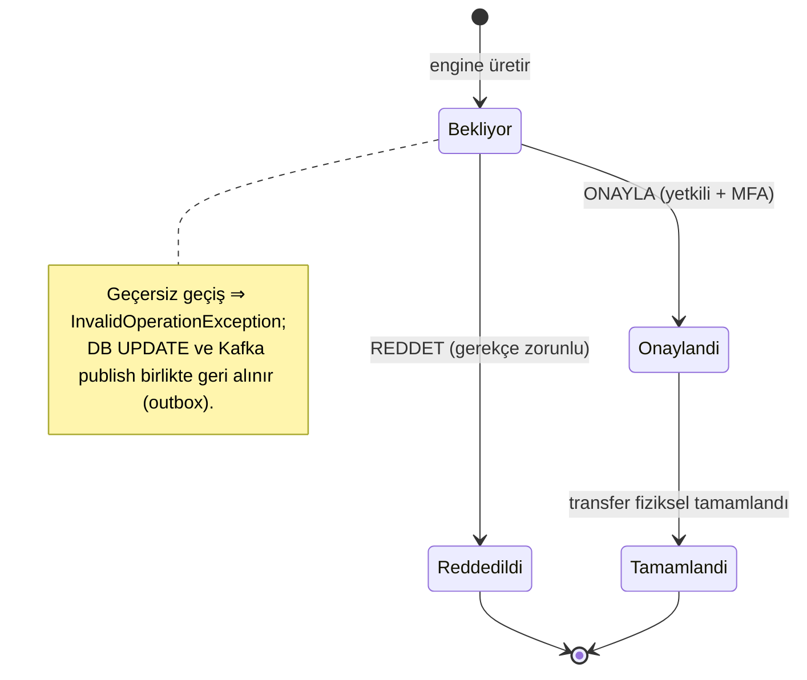

# Migration Blueprint — Arabica Cafe Dinamik Kaynak Yönetim Sistemi
## Java 21 / Spring Boot (design) → C# 12 / .NET 8 LTS (re-implementation)

**Document type:** Phase 1 — Migration Blueprint (architecture & contracts only; *skeletal signatures, no implementation bodies*)
**Source of truth:** [project-srs.md](project-srs.md) · [context.md](context.md) · [agent_handoff.md](agent_handoff.md)
**Status:** For review. No code is built until this blueprint is approved.

> **Re-platforming stance.** There is no Java source to port. This is a fresh, idiomatic .NET 8 solution that is *behaviorally faithful* to the frozen design: every API contract, domain rule, NFR, and legal constraint is preserved, while the implementation uses native .NET idioms (async/await, Channels, EF Core, SignalR, keyed DI). Java-isms (getters/setters, thread-per-request, entities doing their own I/O) are explicitly rejected and adapted — each such adaptation is called out.

---

## 1. Technology & Idiom Mapping

| Concern | Source design (Java/Spring) | Target (.NET 8) | Justification |
|---|---|---|---|
| Language / Runtime | Java 21 / JVM | **C# 12 / .NET 8 LTS** | Mandated. Nullable reference types on, implicit usings on. |
| Concurrency model | Virtual Threads (Loom) | **async/await + `Task`**, `System.Threading.Channels` for the in-process event pipeline | Async I/O already gives the non-blocking, high-throughput profile Loom targets. A bounded `Channel<T>` decouples the Kafka consumer from processing and gives backpressure — no thread-per-event. |
| Web framework | Spring Boot MVC | **ASP.NET Core 8 (Controllers)** | Controllers (not Minimal APIs) to keep the 5 fixed contracts explicit and attribute-routed. |
| Dependency Injection | Spring context | **`Microsoft.Extensions.DependencyInjection`** | Native. Uses **.NET 8 keyed services** for the Strategy pattern. |
| ORM / Persistence | Hibernate / JPA + Spring Data | **EF Core 8 + Npgsql** | EF Core used as **ORM only** (mapping to Liquibase-owned tables); parameterized queries by default (XSS/SQLi invariant). |
| Database | PostgreSQL 16 LTS | **PostgreSQL 16 LTS** (unchanged) | — |
| DB migrations | Liquibase | **Liquibase (KEPT)** as schema authority; EF migrations disabled | Runs language-agnostically via Docker/CLI. EF Core never owns schema (`EnsureCreated`/`Migrate` not called). Drift test in CI. |
| Messaging | Kafka 3.7 (spring-kafka) | **Kafka 3.7 via `Confluent.Kafka`** | Mandated client. Manual offset commit, idempotent producer. |
| Stream processing | Kafka Streams API | **In-app consumer + `Channel<T>` processing** (default) | Plain consumer meets the ≤2 s budget with the least operational complexity. `Streamiz.Kafka.Net` only if a windowed topology is later required — **tradeoff:** Streamiz adds a RocksDB-backed state store + changelog topics + more failure modes; not justified for current FRs. |
| Realtime push | WebSocket | **SignalR** (WebSocket transport, auto-fallback) | Hub + strongly-typed client; JS client swaps raw `WebSocket` for `@microsoft/signalr`. |
| Security / Auth | Spring Security + JWT | **`JwtBearer` auth + policy-based Authorization** | Stateless JWT; RBAC via authorization policies + claims. |
| Password hashing | salted strong hash | **`PasswordHasher<T>` (PBKDF2, salted)** | Built-in, non-reversible. BCrypt.Net-Next is the documented fallback. |
| MFA (critical approvals) | (mandated, channel unspecified) | **TOTP via `Otp.NET`** (authenticator app) | Default = authenticator TOTP; SMS/email OTP optional. *(Gap — see §9.)* |
| Secret/field encryption (AES-256) | AES-256 | **ASP.NET Core Data Protection (AES-256-CBC + HMAC)** for field-level; secrets via Docker secrets / env, never in `appsettings.json` | Keyring persisted to a protected volume. |
| Health / metrics | Actuator | **ASP.NET Core HealthChecks** (`/health`, `/health/ready`) + **OpenTelemetry → Prometheus** | `AspNetCore.HealthChecks.NpgSql` + `.Kafka`; OTel for the latency histogram. |
| Validation | Bean Validation | **DataAnnotations + FluentValidation** | FluentValidation for request DTO rules; DataAnnotations for simple cases. |
| Mediation / Observer fan-out | Spring events | **In-process notification dispatcher** (custom or MediatR 12.x) | Decouples Kafka consumer from subscribers. *(MediatR licensing — see §9.)* |
| Resilience / retry | Spring Retry | **Polly / `Microsoft.Extensions.Http.Resilience`** | Kafka reconnect backoff, transient DB retry. |
| Reporting export | JS chart libs + export | **CsvHelper** (CSV) / **ClosedXML** (XLSX) | Server-side export for "Şube Kapasite" & "Transfer Geçmişi" reports. |
| Holiday / calendar anomalies | (rules) | **`Nager.Date`** (TR public holidays) + custom `ITakvimAnomaliSaglayici` | Academic (vize/final) and Ramazan windows are config-driven providers. |
| Logging / audit | logback | **`ILogger<T>`** + **Serilog** structured sink | Structured audit log (actor, IP, timestamp) to a dedicated store. |
| Config | `application.yml` | **`appsettings.json` + `IOptions<T>`** | Strongly-typed options, env override, secrets out-of-band. |
| Containerization | Docker / Compose | **Multi-stage .NET image + updated `docker-compose.yml`** | app + Postgres + Kafka + Liquibase step. |
| Frontend | HTML5 / Bootstrap 5 / ES6 | **Unchanged static SPA**; SignalR JS client; `.resx` for TR strings | i18n-ready structure preserved. |

---

## 2. Target Solution Layout

Clean/onion architecture. Dependencies point inward; the API project is the only composition root.

```
Arabica.sln
├─ src/
│  ├─ Arabica.Domain            // entities, value objects, enums, domain events,
│  │                            //   state machine, domain interfaces, İş Kanunu guard contracts.
│  │                            //   ZERO external dependencies.
│  ├─ Arabica.Application       // use-case handlers, DTOs (records), FluentValidation,
│  │                            //   strategy resolver, PORTS (interfaces) to infra:
│  │                            //   IKafkaVeriServisi, IDashboardNotifier, IOutbox,
│  │                            //   repositories, IUnitOfWork, ITakvimAnomaliSaglayici.
│  ├─ Arabica.Contracts         // immutable Kafka event records + API request/response records.
│  │                            //   The "frozen contract" surface; referenced by App + Infra + Api.
│  ├─ Arabica.Infrastructure    // EF Core (HotDbContext, HistoryDbContext) + Npgsql,
│  │                            //   Confluent.Kafka producers/consumers, Outbox dispatcher,
│  │                            //   SignalR notifier adapter, audit store, AES (Data Protection),
│  │                            //   calendar providers, identity/credential store.
│  └─ Arabica.Api               // ASP.NET Core host: 5 controllers, JWT, policies, SignalR Hub,
│                               //   health checks, middleware (exception→ProblemDetails, IP capture),
│                               //   DI composition root, appsettings, wwwroot static SPA.
├─ tests/
│  ├─ Arabica.Domain.Tests      // unit: state machine, İş Kanunu guards, occupancy calc.
│  ├─ Arabica.Application.Tests // unit: handlers, strategy resolution, validators.
│  ├─ Arabica.Integration.Tests // Testcontainers: Kafka + Postgres, outbox, end-to-end.
│  └─ Arabica.Latency.Tests     // ≤2 s end-to-end measurement harness.
├─ db/
│  └─ liquibase/                // changelog-master.xml + hot/ and hist/ changesets (schema authority).
├─ docker/
│  ├─ Dockerfile                // multi-stage .NET 8.
│  └─ docker-compose.yml        // app + postgres(+replica) + kafka + liquibase migrate step.
└─ web/                         // static SPA (HTML5/Bootstrap5/ES6 + @microsoft/signalr).
```

**Reference graph (acyclic):**

```
Domain ⭠ Application ⭠ Infrastructure
   ⭡          ⭡              ⭡
Contracts ⭠──┴──────────────┘
                    Api ──► Application, Infrastructure, Contracts   (composition root)
Tests ──► (all)
```

**Idiomatic adaptation flagged:** in the Java design `TransferEmri.DurumGuncelle()` itself persists and emits to Kafka. In .NET the **entity owns only transition validation + state mutation + raising a domain event**; the **Application handler** performs the transactional persist+outbox-enqueue. Observable behavior and the "DB and Kafka cannot diverge" guarantee are preserved (via outbox); entities-doing-I/O is rejected as non-idiomatic. See §5/§7.

---

## 3. NuGet Manifest (pinned to .NET 8 line)

| Package | Version | Project | Purpose |
|---|---|---|---|
| `Microsoft.EntityFrameworkCore` | 8.0.* | Infrastructure | ORM core |
| `Npgsql.EntityFrameworkCore.PostgreSQL` | 8.0.* | Infrastructure | PostgreSQL provider |
| `Confluent.Kafka` | 2.6.* | Infrastructure | Kafka producer/consumer |
| `Microsoft.AspNetCore.Authentication.JwtBearer` | 8.0.* | Api | JWT bearer auth |
| `Microsoft.IdentityModel.Tokens` / `System.IdentityModel.Tokens.Jwt` | 8.* | Infrastructure/Api | token signing/validation |
| `FluentValidation.DependencyInjectionExtensions` | 11.* | Application | request validation |
| `MediatR` | **12.4.*** | Application | notification dispatch (Observer) — *see §9 licensing; pluggable* |
| `Microsoft.Extensions.Http.Resilience` | 8.* | Infrastructure | Polly-based retry/backoff |
| `Otp.NET` | 1.4.* | Infrastructure | TOTP MFA |
| `Nager.Date` | 2.* / latest | Infrastructure | TR public holidays |
| `Serilog.AspNetCore` | 8.* | Api | structured/audit logging |
| `OpenTelemetry.Extensions.Hosting` | 1.9.* | Api | metrics/traces host |
| `OpenTelemetry.Instrumentation.AspNetCore` | 1.9.* | Api | HTTP instrumentation |
| `OpenTelemetry.Exporter.Prometheus.AspNetCore` | 1.9.*-beta | Api | `/metrics` scrape (incl. e2e latency histogram) |
| `AspNetCore.HealthChecks.NpgSql` | 8.* | Api | DB liveness/readiness |
| `AspNetCore.HealthChecks.Kafka` | 8.* | Api | broker readiness |
| `CsvHelper` | 33.* | Infrastructure | report CSV export |
| `ClosedXML` | 0.10x | Infrastructure | report XLSX export |
| `Streamiz.Kafka.Net` | 1.5.* | Infrastructure | **optional** stream topology (off by default) |
| **Tests** | | | |
| `xunit`, `xunit.runner.visualstudio` | 2.9.* | tests | test framework |
| `FluentAssertions` | 6.* | tests | assertions |
| `NSubstitute` | 5.* | tests | mocking (Moq avoided due to SponsorLink history) |
| `Microsoft.AspNetCore.Mvc.Testing` | 8.0.* | Integration.Tests | in-memory API host |
| `Testcontainers.PostgreSql` | 3.* | Integration.Tests | ephemeral Postgres |
| `Testcontainers.Kafka` | 3.* | Integration.Tests | ephemeral Kafka |

*SignalR server needs no package (in ASP.NET Core 8 shared framework). Data Protection (AES-256) and `PasswordHasher<T>` are also in-framework.*

---

## 4. Domain Model

### 4.1 Class diagram (Mermaid)

```mermaid
classDiagram
    class Personel {
        <<abstract>>
        +int PersonelId
        %% KVKK: NO PII here. AdSoyad lives only in restricted KimlikKayit store, never in Kafka/analytics.
        +string TakmaAd
        +MesaiBaslat() void
        +MesaiBitir() void
    }
    class Barista {
        +DateTimeOffset? MesaiBaslangic
        +TimeSpan GunlukCalismaSuresi
    }
    class SubeMuduru {
        +int SorumluSubeId
        +TransferOnayla(TransferEmri) void
        +TransferReddet(TransferEmri, string gerekce) void
    }
    class Sube {
        +int SubeId
        +int MaksimumKapasite
        +int AnlikMusteriSayisi
        +int AktifPersonelSayisi
        +DolulukOraniHesapla() decimal
        +DolulukSeviyesi Seviye
    }
    class TransferEmri {
        +long EmirId
        +int KaynakSubeId
        +int HedefSubeId
        +KaynakTipi Tip
        +TransferDurumu Durum
        +string? RedGerekcesi
        +DateTimeOffset OlusturulmaZamani
        +DurumGuncelle(string yeniDurum) void
    }
    class OptimizasyonMotoru {
        +DarbogazTespitiYap() IReadOnlyList~Darbogaz~
        +DarbogazHesapla(Sube) DarbogazSonucu
        +TransferOnerisiUret(Sube kaynak, Sube hedef) TransferEmri
    }
    class IOptimizasyonServisi {
        <<interface>>
        +DarbogazHesapla(Sube) DarbogazSonucu
        +TransferOnerisiUret(Sube kaynak, Sube hedef) TransferEmri
    }
    class IKafkaVeriServisi {
        <<interface>>
        +PosVerisiOku(CancellationToken) IAsyncEnumerable~PosOlayi~
        +PdksVerisiOku(CancellationToken) IAsyncEnumerable~PdksOlayi~
        +TransferBildirimiGonder(TransferEmri, CancellationToken) Task
    }
    class IIsKanunuKurali {
        <<interface>>
        +Degerlendir(Barista, Sube hedef, SeyahatSuresi) KuralSonucu
    }
    Personel <|-- Barista
    Personel <|-- SubeMuduru
    IOptimizasyonServisi <|.. VizeFinalSezonStratejisi
    IOptimizasyonServisi <|.. YazDonemiStratejisi
    OptimizasyonMotoru --> IOptimizasyonServisi : strategy
    OptimizasyonMotoru --> ITransferEmriFactory : creates
    OptimizasyonMotoru --> IIsKanunuKurali : guards
    TransferEmri --> TransferDurumu
    TransferEmri --> KaynakTipi
    Sube --> DolulukSeviyesi
```



### 4.2 Enums & state machine

```csharp
public enum TransferDurumu { Bekliyor, Onaylandi, Reddedildi, Tamamlandi }
public enum KaynakTipi     { Personel, Ekipman }
public enum DolulukSeviyesi { Yesil, Sari, Kirmizi }   // thresholds config-driven (see §9)
```



Allowed-transition set is the single source of truth inside `TransferEmri.DurumGuncelle`; anything else throws before any persistence occurs.

---

## 5. Pattern Implementation Plan (.NET DI)

### 5.1 Strategy — seasonal optimization algorithms
- Contract `IOptimizasyonServisi` with `DarbogazHesapla(Sube)` + `TransferOnerisiUret(Sube, Sube)`.
- Concrete `VizeFinalSezonStratejisi`, `YazDonemiStratejisi` registered as **.NET 8 keyed services**:
  ```csharp
  services.AddKeyedScoped<IOptimizasyonServisi, VizeFinalSezonStratejisi>("vize-final");
  services.AddKeyedScoped<IOptimizasyonServisi, YazDonemiStratejisi>("yaz");
  ```
- `IOptimizasyonStratejiResolver.Sec(DateTimeOffset an)` consults `ITakvimAnomaliSaglayici` and returns the right keyed instance at **runtime**. Adding a season = new class + one registration; `OptimizasyonMotoru` is untouched.

### 5.2 Observer — fan-out of incoming Kafka events
- **Single** Kafka consumer (`BackgroundService`) writes each decoded event into a bounded `Channel<T>`.
- A pump publishes one notification per event to an in-process dispatcher; **multiple independent handlers** subscribe:
  - `DashboardBildirimHandler` → SignalR hub (occupancy bars),
  - `OptimizasyonTetikleyiciHandler` → triggers `OptimizasyonMotoru`,
  - `DenetimLogHandler` → audit logger.
- Implemented via **MediatR 12.x** `INotification`/`INotificationHandler` (decided — see §9 G8); kept behind the interface so a custom dispatcher can replace it with no domain impact. **Adding a subscriber requires no producer change** (the Observer guarantee).

### 5.3 Factory Method — transfer-order creation
- `ITransferEmriFactory` with `PersonelTransferiOlustur(...)` and `EkipmanTransferiOlustur(...)` returning `TransferEmri` (variant data per `KaynakTipi`).
- `OptimizasyonMotoru` depends on the abstraction only; concrete creation (and future variants like spare-POS/chairs) stays inside the factory — Single Responsibility preserved.

---

## 6. Constraint-to-Mechanism Map

| Constraint (source) | .NET mechanism |
|---|---|
| **NFR-P1 ≤2 s end-to-end** | Edge stamps `uretimZamani` (ISO) in each event payload. Async ingest → bounded `Channel<T>` (no thread-per-event) → engine → SignalR push. On push, compute `now − uretimZamani` and record an **OpenTelemetry histogram `arabica_e2e_latency_seconds`**; alert if p99 > 2 s. Latency harness test in Phase 2. |
| **NFR-P2 ~1 Hz dashboard** | SignalR hub broadcasts occupancy snapshots on a 1 s timer / on-change, throttled. |
| **NFR-P4 schema isolation** | Two EF `DbContext`s: `HotDbContext` (schema `hot`, real-time reads, may target read-replica) and `HistoryDbContext` (schema `hist`, historical writes/audit, primary). Separate connection strings → no read/write lock contention. |
| **KVKK (NFR-L1) — no PII** | Kafka payloads & analytics tables carry only numeric `PersonelId`/`SubeId`. Name/phone/TC live in a restricted `kimlik` store (separate schema, manager-only access), encrypted at rest; never produced to Kafka. DTO records simply have no PII fields. |
| **İş Kanunu 4857 (NFR-L2)** | Composable `IIsKanunuKurali` guards evaluated in `TransferOnerisiUret`: `GunlukAzamiMesaiKurali`, `ZorunluMolaKurali`, `SeyahatSuresiMesaiyeDahilKurali` (travel time added to worked time). Each returns `KuralSonucu(bool Uygun, string Gerekce)`; a failing guard blocks the transfer with a human-readable Turkish reason. Statutory thresholds are config (see §9). |
| **NFR-L3 cultural anomalies** | `ITakvimAnomaliSaglayici` composes `Nager.Date` (national/religious holidays) + academic-calendar + Ramazan iftar/sahur windows; feeds the strategy resolver and prediction adjustments. |
| **JWT / RBAC** | `JwtBearer` auth; policy-based authorization: `Policy("BolgeKoordinatoru")`, `Policy("SubeMuduru")`; `[Authorize(Policy=...)]` on controllers; branch-scoped data filtered by `subeId` claim. |
| **MFA on critical approvals** | `POST /api/v1/transfer/islem` with `aksiyon=ONAYLA` requires a valid TOTP (`Otp.NET`) second factor before the state transition is accepted. |
| **Idle session 15 min** | Stateless: short-lived access token (15 min expiry, no server-side sliding) + client idle-detection clears SessionStorage token; optional refresh-token rotation (opt-in, see §9). |
| **Account lockout + reCAPTCHA** | Failed-login counter in `hist` audit store; lockout window; reCAPTCHA (v3 score + v2 fallback) verified server-side via `HttpClient`. |
| **Parameterized queries / XSS** | EF Core parameterizes by design (never string-concat SQL); responses are JSON (no server HTML); client encodes on render. |
| **AES-256 secrets** | ASP.NET Core Data Protection (AES-256-CBC+HMAC) for field encryption; runtime secrets via Docker secrets/env. |
| **NFR-S7 audit (IP+timestamp)** | Middleware captures client IP (honoring `X-Forwarded-For` from the reverse proxy); every login (success/fail), password reset, transfer approval → immutable `denetim_log` row (`hist` schema) with actor, IP, UTC timestamp. |
| **DB ports never exposed** | `docker-compose.yml` does not publish Postgres ports to host; only the app network can reach it; firewall note in README. |
| **Reliability 99.9% / failover** | Postgres Primary–Replica; app retries on transient via Polly; container restart policy; health-gated readiness. |
| **Kafka retention ≥ 7 days** | Topic config `retention.ms=604800000`. |
| **Local buffering / sequential replay** | Edge producer buffers to local disk on disconnect; on reconnect replays in offset/partition order. App side: idempotent producer + manual offset commit after successful processing ⇒ lossless, ordered. |
| **Sensor-loss → failover estimate** | `HealthCheck`/anomaly detector on the density topic; if no sensor events, engine switches to POS-only estimation strategy. |

---

## 7. Kafka Design in .NET

**Topics** (key = `SubeId` for per-branch ordering):

| Topic | Direction | Notes |
|---|---|---|
| `arabica.pos.olaylari` | inbound | POS sales events; retention 7d; snappy/zstd compression (hierarchical JSON). |
| `arabica.pdks.olaylari` | inbound | staff attendance events; retention 7d. |
| `arabica.transfer.bildirimleri` | outbound | transfer state-change notifications (from outbox). |

**Consumer groups:** `arabica-ingest` (POS/PDKS → channel → observers). Manual commit (`EnableAutoCommit=false`) **after** successful processing ⇒ at-least-once + lossless replay.

**Producer config:** `Acks=All`, `EnableIdempotence=true`, `MaxInFlight=5`, small `LingerMs` (latency vs. batching), compression `Zstd`.

**Offline tolerance:** idempotent producer + ordered keys; consumer re-reads uncommitted offsets after a restart; edge buffering replays sequentially.

**Transactional outbox (the transfer-notify guarantee):**
1. `TransferIslemHandler` opens an EF transaction.
2. `transferEmri.DurumGuncelle(...)` validates + mutates (throws on illegal transition → tx never commits).
3. Same transaction: `UPDATE transfer_emirleri` **and** `INSERT outbox` (the notification event) commit atomically.
4. `OutboxDispatcher` (`BackgroundService`) polls unpublished rows, produces to `arabica.transfer.bildirimleri`, marks published.
5. Consumers dedupe by event id (idempotent) ⇒ DB commit and Kafka publish **cannot diverge**. *(Alternative considered: `DotNetCore.CAP` — gives outbox out-of-the-box but wraps the producer; rejected to keep `Confluent.Kafka` explicit per mandate. Noted as a swap-in option.)*

---

## 8. Liquibase Integration Plan

- **Liquibase is the schema authority.** EF Core maps to existing tables; `EnsureCreated`/`Migrate` are never called; `MigrationsAssembly` left unconfigured.
- **Changelog layout:** `db/liquibase/changelog-master.xml` includes `hot/*.xml` and `hist/*.xml` changesets. Each changeset declares its `schemaName` (`hot` or `hist`).
  - `hot`: `sube`, `sube_doluluk_anlik`, `personel` (anonymized), credential store metadata.
  - `hist`: `transfer_emirleri` (+ audit archive), `doluluk_gecmis`, `denetim_log`, `outbox`.
- **Two DbContexts** mirror the two schemas (default schema set per context) → satisfies NFR-P4 isolation and lets `HotDbContext` point at a read-replica connection string.
- **Drift guard (CI):** a test compares `dbContext.Database.GenerateCreateScript()` (model expectation) against the Liquibase-applied schema; build fails on divergence — keeps EF model and Liquibase truth in lockstep without EF owning DDL.
- **Compose ordering:** `postgres` healthy → `liquibase` (official image, changelogs mounted) runs `update` → `app` starts. App readiness probe blocks traffic until migrations are applied.

---

## 9. Risks, Gaps & Assumptions

Each item is a place the source docs are silent/ambiguous; the proposed default is conservative and does **not** add undocumented product features.

| # | Gap / ambiguity | Proposed default (for approval) |
|---|---|---|
| G1 | **Idle timeout vs. stateless JWT.** Docs say SessionStorage + 15-min idle, but stateless JWT can't track idle server-side. | **DECIDED — client-side only.** Access token 15-min expiry (no server-side sliding); client idle-detection clears the SessionStorage token on inactivity; re-login after expiry. **No refresh-token store** — server stays purely stateless, matching the docs literally. |
| G2 | **KVKK vs. `Personel.AdSoyad`.** Base class lists `AdSoyad`, but no PII may persist/flow. | Domain `Personel` exposes `PersonelId` + non-identifying `TakmaAd`; real name/phone live only in a restricted, encrypted `kimlik` store used solely for login/display to authorized managers — never in Kafka or analytics tables. |
| G3 | **MFA channel** unspecified. | **TOTP** (authenticator app, `Otp.NET`). SMS/email OTP can replace it later. |
| G4 | **reCAPTCHA version** unspecified. | reCAPTCHA **v3** (score) with **v2** challenge fallback. |
| G5 | **Occupancy thresholds** (yeşil/sarı/kırmızı %) not numerically defined. | Config defaults: `<60%` Yeşil, `60–85%` Sarı, `>85%` Kırmızı — overridable in `appsettings.json`. |
| G6 | **İş Kanunu 4857 exact limits** (daily max hours, break durations) not stated. | Config-driven statutory defaults (e.g., daily ≤11 h, break 30 min for 4–7.5 h / 60 min for >7.5 h, weekly 45 h). **Requires legal review before production.** |
| G7 | **Travel-time data source.** Traffic API is roadmap, not built. | Static branch-to-branch **travel matrix** in config now; pluggable `ISeyahatSuresiSaglayici` so a live traffic provider can drop in later. |
| G8 | **MediatR licensing.** Recent MediatR versions moved toward commercial licensing. | **DECIDED — MediatR 12.x (free/MIT), pinned.** Do **not** upgrade past 12.x without re-evaluating licensing. Observer wiring stays behind `INotification`/`INotificationHandler` so it remains swappable for a custom dispatcher with no domain impact if licensing changes. |
| G9 | **Stream processing.** Kafka Streams has no exact .NET peer. | Default = plain consumer + `Channel<T>` (meets ≤2 s, simplest). `Streamiz.Kafka.Net` only if a stateful windowed topology is later required. |
| G10 | **Engine trigger cadence** ("continuous scan" in docs). | **Event-triggered** evaluation with a small debounce window (e.g., 250 ms) to coalesce bursts and stay within the 2 s budget; configurable. |
| G11 | **Error response shape / logout / pagination** not specified. | **ProblemDetails (RFC 7807)** with Turkish messages; stateless logout = client discards token (+ optional server refresh-token revoke if G1 opt-in chosen); list endpoints support `?sayfa&boyut` pagination. |
| G12 | **Equipment transfer entity detail** is thin in docs. | Factory supports `KaynakTipi.Ekipman`; minimal fields now (equipment type + count), extensible later. |
| G13 | **Branch count.** Pilot = 2 (Isparta). | Code generalizes to N branches; no hard-coded 2. |
| G14 | **Read-replica routing.** Failover is required; replica read-routing not detailed. | `HotDbContext` uses a replica-capable connection string; writes/audit always to primary. Manual/orchestrated failover (out-of-app, e.g., Patroni) assumed — documented in README. |

---

## 10. Phase 2 Delivery Plan (locked decisions)

Decisions confirmed during review, to be applied in Phase 2:
- **Mediation:** MediatR 12.x (free), pinned — §9 G8.
- **Session:** client-side idle handling only, pure stateless JWT, no refresh-token store — §9 G1.
- **Delivery cadence:** **vertical slices with a review pause between each.** Build order:

| Slice | Scope | Tests | Gate |
|---|---|---|---|
| **S1** | `Arabica.Domain` + `Arabica.Contracts`: entities, `TransferDurumu` state machine, İş Kanunu guard rules, occupancy calc | unit (state-machine transitions, labor-law guards, `DolulukOraniHesapla`) | review → proceed |
| **S2** | `Arabica.Infrastructure`: EF Core `Hot`/`History` contexts + Npgsql, Confluent.Kafka producer/consumer, **outbox** dispatcher, Liquibase changelogs | integration (Testcontainers: Postgres + Kafka, outbox atomicity) | review → proceed |
| **S3** | `Arabica.Api`: JWT auth + policy RBAC, the **5 controllers** on exact contracts, FluentValidation, ProblemDetails, audit middleware (IP+timestamp), MFA on approve | API integration (`WebApplicationFactory`), contract tests | review → proceed |
| **S4** | SignalR hub + JS client, multi-stage Dockerfile, `docker-compose.yml` (app + Postgres + Kafka + Liquibase), health checks, AES-256 secret handling, **≤2 s latency harness**, README | latency measurement + `docker compose up` smoke | final review |

Each slice ends with `dotnet build` green and its tests passing before the next begins.

---

Awaiting approval to proceed to Phase 2.
